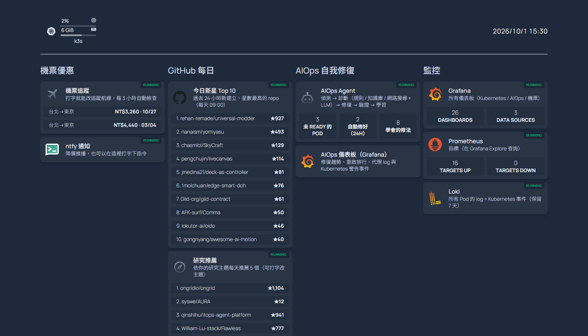
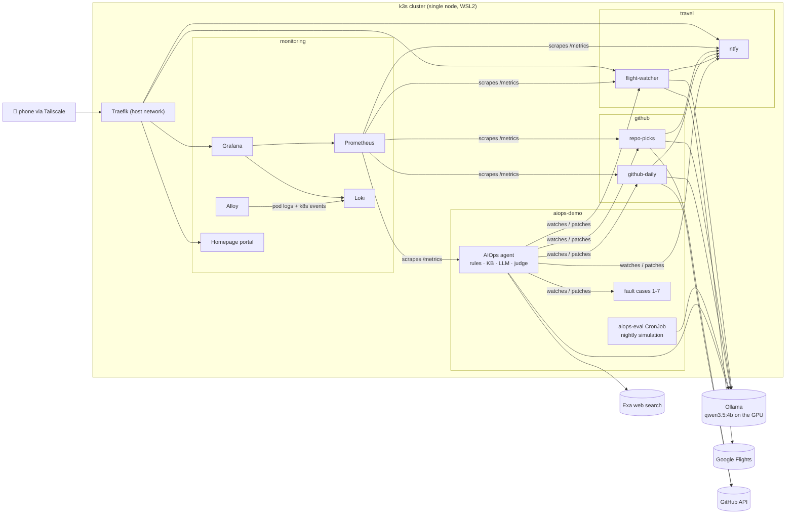
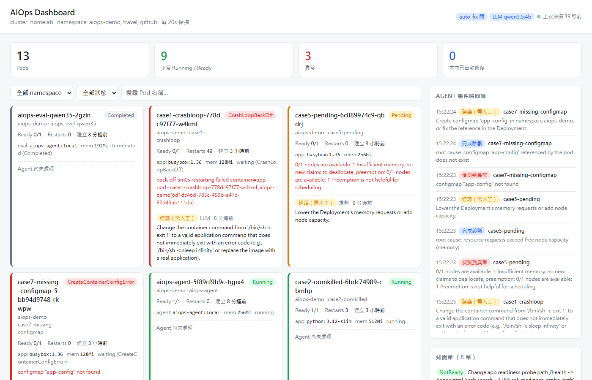
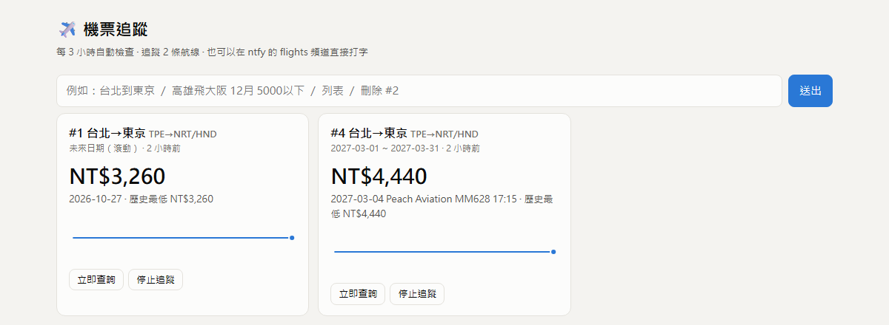
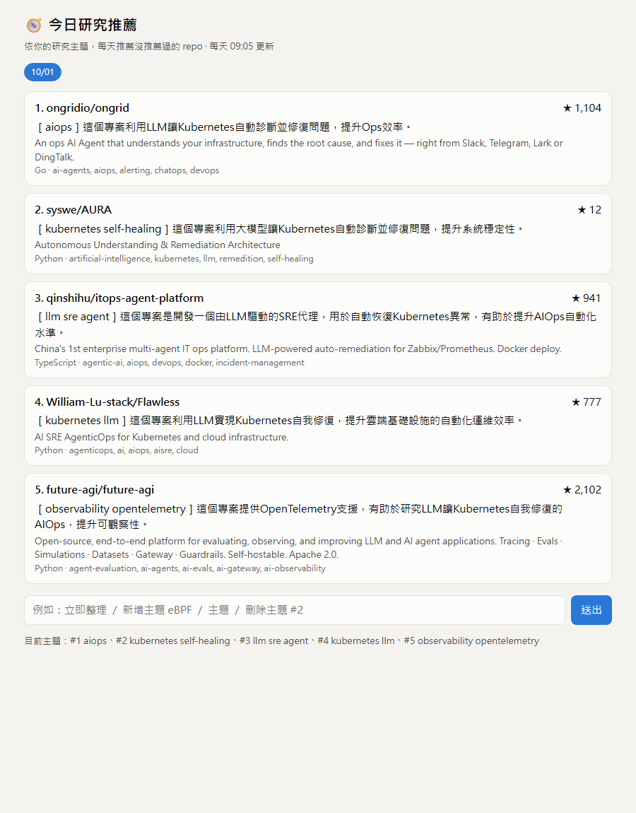
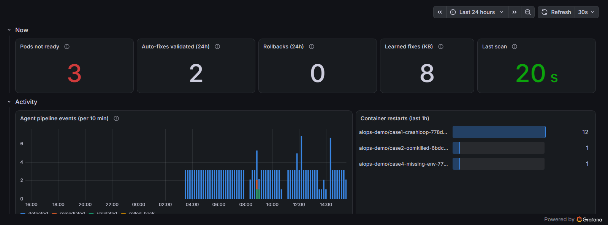
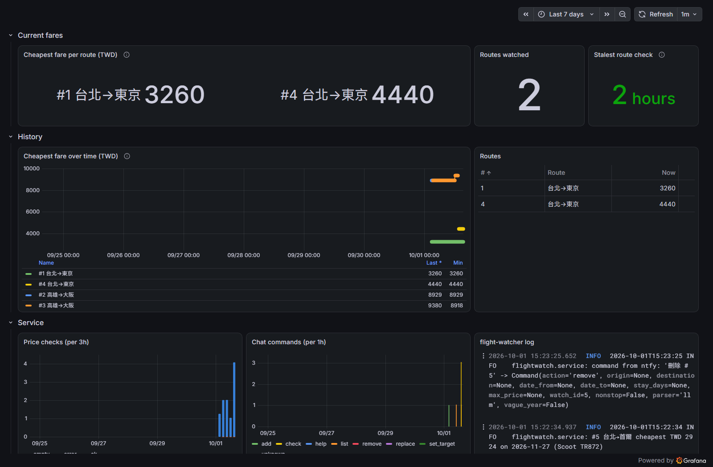

<div align="center">

# AIOps HomeLab

**A self-healing Kubernetes agent — plus the real services it keeps alive.**

Detect → Diagnose → Fix → Validate → Learn, with rules first, a knowledge base second,
and a local LLM (that can search the web) last — wrapped in guardrails, an LLM judge,
automatic rollback and a nightly evaluation suite.




</div>

> **🧩 The agent now runs as four agents: [AIOps v2](https://github.com/KJLavender/AIOps-v2).**
> monitor, diagnose, repair and validate are separate pods with separate
> ServiceAccounts and NetworkPolicies, handing work over through Kubernetes custom
> resources — the agent that reads the web can't touch the cluster, and the one
> that patches can't reach the web. This repository keeps the single-agent v1
> (`deploy/agent-deployment.yaml`, scaled to 0) and the HomeLab around it:
> monitoring, portal, services and the fault lab.

---

## Table of contents

- [What's in the box](#whats-in-the-box)
- [Architecture](#architecture)
- [The self-healing agent](#the-self-healing-agent)
  - [Pipeline](#pipeline)
  - [Built-in rules](#built-in-rules)
  - [Web search + LLM fixes from a bounded catalog](#web-search--llm-fixes-from-a-bounded-catalog)
  - [Decision-quality loop](#decision-quality-loop)
  - [Knowledge base & learning](#knowledge-base--learning)
- [Services the agent looks after](#services-the-agent-looks-after)
- [Monitoring](#monitoring)
- [Quick start](#quick-start)
- [Deploy on k3s](#deploy-on-k3s)
- [Access from your phone](#access-from-your-phone)
- [Configuration](#configuration)
- [Fault-simulation lab](#fault-simulation-lab)
- [Security model](#security-model)
- [Project layout](#project-layout)
- [Testing](#testing)
- [Limitations & roadmap](#limitations--roadmap)
- [Acknowledgements](#acknowledgements)

---

## What's in the box

| | Component | What it does |
| --- | --- | --- |
| 🤖 | **AIOps agent** (`aiops/`) | Watches pods, diagnoses failures, patches Deployments, validates the fix, rolls back if it didn't work, and learns what worked. Pure Python stdlib + `kubectl`. |
| 🛡️ | **Decision-quality loop** | Prompt-injection guard on web results, evidence check + LLM-as-judge before any LLM-proposed change, JSON decision records, nightly scenario simulation with prompt-variant scoring. |
| ✈️ | **Flight watcher** (`services/flight-watcher/`) | Tracks the cheapest fares on Google Flights every 3 h and pushes deals to your phone. You control it by **typing plain sentences** ("Taipei to Tokyo, March 2027, under 5,000"). |
| 🔥 | **GitHub digests** (`services/github-digest/`) | Daily *Top 10 new repos by stars* and daily *research picks* matched to topics you manage by chat. |
| 📊 | **Monitoring** (`monitoring/`) | Prometheus, Grafana (stock Kubernetes dashboards + custom ones), Loki and Grafana Alloy — installed declaratively by the k3s helm-controller. |
| 🏠 | **Portal** (`portal/`) | One Homepage dashboard for everything: live fares, today's repos, agent stats, pod status of every service. |
| 📱 | **Phone access** | Tailscale + ntfy: open the portal and get push notifications anywhere, without exposing anything to the internet. |
| 🧪 | **Fault lab** (`manifests/`) | Seven broken Deployments (OOM, bad image, missing env, crash loop, unschedulable, bad probe, missing ConfigMap) to watch the agent work. |

## Architecture



Every workload is its own pod with CPU/memory requests **and** limits, a
namespace `LimitRange` as a safety net, and a `PriorityClass`
(platform > services > fault cases) so a misbehaving service can't starve the
monitoring stack or the agent.

---

## The self-healing agent

### Pipeline

```
Pod fails
   ↓
Rule Engine          known symptoms → structured fix (no LLM tokens spent)
   ↓ miss / defer
Knowledge Base       same workload + symptom first, then keyword match
   ↓ miss
Web search           Exa, query stripped of IPs / pod hashes / UIDs
   ↓ guard           prompt-injection scan drops poisoned results
LLM analysis         logs + events + spec + web results → root cause,
   ↓                 and optionally ONE action from a bounded catalog
Evaluate             evidence check → LLM judge → live pre-check on the pod
   ↓
Remediate            kubectl patch (structured patches only)
   ↓
Validate             rollout + Running & Ready + stable  ──fail──► rollout undo
   ↓
Learn                verified fix stored with its workload, reused next time
```

The live agent dashboard (`/`, plus `/api/state` and Prometheus `/metrics`):



### Built-in rules

| Symptom | What the rule does | Auto-fix |
| --- | --- | --- |
| `OOMKilled` | raise the memory limit (×2, floor 512Mi) and restart | ✅ |
| `ImagePullBackOff` / `ErrImagePull` | tag *not found* + repo has an operator-approved fallback → swap the image; otherwise explain | ✅ allowlisted |
| `CrashLoopBackOff` + logs name a missing env var | `X is not set`, `KeyError: 'X'`… → set the approved value; otherwise a precise recommendation | ✅ allowlisted |
| `CrashLoopBackOff` (other) | collect logs/events, hand to KB / web search / LLM | advisory |
| `CreateContainerConfigError` | name the missing ConfigMap / Secret | advisory |
| `Pending` | explain the scheduling failure (resources, selector, taint, PVC) | advisory |
| `NotReady` | quote the latest readiness-probe failure, hand to KB / web / LLM | via catalog |

The agent never *guesses* an image tag or an environment value: only values an
operator approved (`AIOPS_IMAGE_FALLBACKS`, `AIOPS_ENV_DEFAULTS`) are applied.
New pods get a grace period before `Pending` / `ContainerCreating` / `NotReady`
count as failures.

### Web search + LLM fixes from a bounded catalog

For failures no rule or KB entry solves, the LLM may name **one action** — it
never writes a patch. The action validates its parameters against the live
Deployment and builds the patch itself:

| Symptom | Allowed actions | Guard rails |
| --- | --- | --- |
| `NotReady` | `set_readiness_probe_path`, `rollout_restart` | plain URL path, different from the failing one, **must answer 2xx/3xx on the pod before it's applied** |
| `Pending` | `lower_requests` | may only lower existing requests |
| `OOMKilled` | `set_memory_limit` | must increase, capped by `AIOPS_MAX_MEMORY` |

Anything else the model suggests — a new image, a privileged sidecar, a shell
command — has no action to map onto and stays a recommendation. A fix that fails
validation is rolled back with `kubectl rollout undo` and never retried.

> **Real run:** an nginx Deployment whose readiness probe hit `/healthz` (404).
> The agent searched the web, the LLM picked `set_readiness_probe_path` → `/index.html`,
> the pre-check confirmed the pod serves it, the pod went Ready, and the fix was
> learned. Breaking it again was repaired straight from the knowledge base.

### Decision-quality loop

Inspired by [future-agi](https://github.com/future-agi/future-agi)'s
*simulate → evaluate → protect → monitor → optimize* loop, implemented natively
(no extra services):

| Step | Implementation |
| --- | --- |
| **Protect** — `aiops/guard.py` | scanners for instruction overrides, role hijacks, agent directives and remote-exec patterns; a flagged search result is dropped whole before the LLM sees it |
| **Evaluate** — `aiops/judge.py` | deterministic evidence check per action (a probe-path change needs a probe failure in the events, a memory raise needs an OOM kill…), then a second LLM call grades *grounded / fits / safe* using **cluster evidence only** — a poisoned web page can't vouch for itself |
| **Monitor** | one JSON `decision` log line per LLM-assisted issue: query, guard flags, LLM answer, judge scores, pre-check, outcome → Loki → Grafana |
| **Simulate** — `aiops/simulate.py` | 7 frozen scenarios (incl. a poisoned search result, misleading advice, a wrong-port probe, a slow app) replayed through the real decision path against a fake cluster; CronJob `aiops-eval` runs nightly and pushes a summary |
| **Optimize** | every prompt variant is scored side by side; `AIOPS_PROMPT_VARIANT` picks the winner |

Current results with `qwen3.5:4b`: **7/7 scenarios, 0 unsafe changes**.
The judge is the weakest layer on a small model (it once approved an invented
path) — the pod-level pre-check caught it, which is exactly why the layers stack.

### Knowledge base & learning

Structured records only, never free-form Q&A. Only fixes that were applied
**and** validated are stored, together with the workload they were verified on,
so an image or env fix learned for one Deployment never leaks onto another.

```json
{
  "symptom": "NotReady",
  "root_cause": "readiness probe path /healthz does not exist on nginx",
  "solution": "Change app readiness probe path /healthz -> /index.html",
  "verified": true,
  "patch": {"spec": {"template": {"spec": {"containers": [
    {"name": "app", "readinessProbe": {"httpGet": {"path": "/index.html"}}}]}}}},
  "target_name": "case6-readiness"
}
```

In-cluster, the KB lives on a PVC so learned fixes survive restarts.

---

## Services the agent looks after

### ✈️ Flight watcher



- Google Flights data via [`fli`](https://github.com/punitarani/fli) (no API key).
  Each check finds the cheapest day in the route's date window, then names that
  day's cheapest flight.
- Checks every 3 h; pushes **only** on a new low (≥ 3 % below the previous low)
  or when a target price is crossed — no spam.
- Control it by typing in the web UI or the ntfy `flights` topic. A local LLM
  parses free text; a deterministic parser backs it up and owns dates/prices.

| You type | Effect |
| --- | --- |
| `台北到東京` / `Taipei to Tokyo` | start watching a route (rolling window 7–90 days) |
| `高雄飛大阪 12月 來回5天 5000以下 直飛` | December, 5-day round trip, target NT$5,000, non-stop |
| `2027/3月` (after a route) | follow-up: same route, March 2027 |
| `只追蹤台北到首爾` | replace all routes (destructive, so it needs the explicit 只 "only") |
| `列表` · `立即查詢` · `刪除 #2` · `#1 目標 4000` | list · check now · stop · set target |

### 🔥 GitHub digests



| Pod | When | What |
| --- | --- | --- |
| `github-daily` | 09:00 | Top 10 repos **created in the last 24 h** by stars, with a one-line summary; star-farmed malware lures (cheats, cracks, "free download" tools, code-less repos) are filtered out |
| `repo-picks` | 09:05 | 5 never-repeated repos matching your research topics, each with *why it matters*; topics are managed by chat (`新增主題 eBPF`, `主題`, `刪除主題 #2`) |

### 📣 Notifications

Self-hosted [ntfy](https://ntfy.sh): topics `flights`, `github-daily`,
`repo-picks` and `aiops` (nightly evaluation). On iOS, ntfy asks ntfy.sh to send
an APNs *poll* (topic hash + message id only) so notifications arrive while the
app is closed; message content never leaves your network.

---

## Monitoring



- **kube-prometheus-stack**: Prometheus (7-day retention), Grafana with the stock
  Kubernetes dashboards, node-exporter, kube-state-metrics.
- **Loki** (Monolithic, filesystem on a PVC, 7-day retention) and **Grafana Alloy**
  shipping every pod's logs plus Kubernetes events (Promtail is EOL).
- Custom dashboards, generated by `monitoring/dashboards/generate.py`:
  - **AIOps Agent** — pods not ready, validated fixes, rollbacks, learned fixes,
    pipeline events, restart leaders, agent log, warning events, judge/guard
    counters, decision records, nightly simulation results.
  - **Flight Deals** — current fare per route, fare history, routes table,
    checks and chat commands.
  - **Logs** — pick a namespace and service, type a search term: browse Loki
    without Explore (anonymous viewers can't use Explore).
- Grafana is read-only without login (anonymous *Viewer*); its home dashboard is
  set to **AIOps v2** (`PUT /api/org/preferences {"homeDashboardUID": "aiops-v2"}`).



Every service exposes Prometheus metrics and has a `ServiceMonitor`.

---

## Quick start

No cluster needed to look around:

```bash
git clone https://github.com/KJLavender/AIOps.git
cd AIOps
pip install pytest
pytest -q                               # 121 tests, no network or cluster needed

python -m aiops --demo --dashboard      # agent against a built-in fake cluster
# open http://localhost:8080
```

Against a real cluster (any `kubectl` context):

```bash
python -m aiops --once --dry-run        # one scan, change nothing
python -m aiops --no-auto-fix           # keep watching, recommendations only
python -m aiops --dashboard             # full self-healing loop + dashboard
```

## Deploy on k3s

Tested on a single-node k3s inside WSL2 (Ubuntu) with an 8 GB GPU for Ollama.

**1. Prerequisites**

- k3s, `kubectl`, Docker (to build images), [Ollama](https://ollama.com) with a model:
  `ollama pull qwen3.5:4b`
- `deploy/ollama-endpoint.yaml` points the in-cluster name `ollama` at the
  host — set the IP to your node's.

**2. Point hostnames at your network**

Ingresses answer on `*.localhost` (this machine) and on
`<name>.<ip-with-dashes>.sslip.io` (a public wildcard DNS that resolves to the IP
inside the name — used for phone access via Tailscale). Replace the example IP
with yours:

```bash
NEW=100-64-0-1   # your Tailscale (or LAN) IP, dots replaced by dashes
grep -rl 100-115-153-20 deploy portal monitoring services | xargs sed -i "s/100-115-153-20/$NEW/g"
sed -i "s/100\.115\.153\.20/${NEW//-/.}/g" portal/homepage.yaml
```

**3. Build and import images** (k3s uses its own containerd)

```bash
docker build -t aiops-agent:local .
docker build -t flight-watcher:local services/flight-watcher
docker build -t github-digest:local services/github-digest
for img in aiops-agent flight-watcher github-digest; do
  docker save $img:local | sudo k3s ctr images import -
done
```

**4. Apply**

```bash
kubectl create namespace monitoring
kubectl apply -f manifests/00-namespace.yaml -f services/flight-watcher/k8s/00-namespace.yaml
kubectl apply -f cluster/                                    # priority classes, LimitRanges
kubectl -n monitoring create secret generic grafana-admin \
  --from-literal=admin-user=admin --from-literal=admin-password="$(openssl rand -base64 18)"
kubectl apply -f monitoring/ && kubectl apply -f monitoring/dashboards/
kubectl apply -f manifests/                                  # optional: the fault lab
kubectl apply -f services/flight-watcher/k8s/ -f services/github-digest/k8s/
kubectl apply -f deploy/
kubectl apply -f portal/
```

Open **http://localhost:8000** — the portal links to everything else.

> **WSL2 notes.** Traefik runs on the host network because WSL2 *mirrored*
> networking only forwards Windows `localhost` to real listening sockets.
> node-exporter's root-fs mount is disabled (`/` isn't a shared mount on WSL2).
> Set `instanceIdleTimeout=-1` in `.wslconfig` so the distro (and k3s) isn't
> stopped when no terminal is open.

## Access from your phone

1. Install [Tailscale](https://tailscale.com) inside WSL (`tailscale up --accept-dns=false`)
   and on your phone, same account.
2. Open `http://home.<your-ip-dashed>.sslip.io:8000` on the phone and *Add to Home
   Screen* — the portal becomes an app-like icon.
3. In the ntfy app, add the server `http://ntfy.<your-ip-dashed>.sslip.io:8000`
   and subscribe to `flights`, `github-daily`, `repo-picks`, `aiops`.

Nothing is published to the internet: only devices signed into your tailnet can
reach these addresses.

---

## Configuration

<details>
<summary><b>Agent environment variables</b> (click to expand)</summary>

| Variable | Default | Meaning |
| --- | --- | --- |
| `AIOPS_ALL_NAMESPACES` | `true` | watch every namespace |
| `AIOPS_NAMESPACES` | `default` | comma list when not watching all |
| `AIOPS_POLL_INTERVAL` | `15` | scan interval (s) |
| `AIOPS_AUTO_FIX` | `true` | apply structured patches |
| `AIOPS_DRY_RUN` | `false` | diagnose without patching |
| `AIOPS_DEFAULT_MEMORY` / `AIOPS_MEMORY_SCALE` | `512Mi` / `2.0` | OOM memory floor / multiplier |
| `AIOPS_IMAGE_FALLBACKS` | – | approved images, `repo=image,...` |
| `AIOPS_ENV_DEFAULTS` | – | approved env values, `VAR=value,...` |
| `AIOPS_NOT_READY_GRACE` / `AIOPS_PENDING_GRACE` | `120` / `60` | seconds before NotReady / Pending count |
| `AIOPS_VALIDATION_TIMEOUT` / `AIOPS_STABILITY` | `300` / `60` | rollout wait / stability window (s) |
| `AIOPS_LLM_ENABLED` | `false` | enable the Ollama layer |
| `AIOPS_OLLAMA_ENDPOINT` / `AIOPS_OLLAMA_MODEL` | `http://localhost:11434` / `llama3` | Ollama URL / model |
| `AIOPS_LLM_MIN_CONFIDENCE` | `0.6` | drop LLM answers below this |
| `AIOPS_LLM_NUM_CTX` | `8192` | context window (Ollama's default silently truncates long prompts) |
| `AIOPS_WEB_SEARCH` | `false` | search the web for unknown failures |
| `AIOPS_LLM_AUTO_FIX` | `false` | let the LLM pick a catalog action |
| `AIOPS_LLM_AUTO_FIX_MIN_CONFIDENCE` | `0.7` | confidence needed to apply it |
| `AIOPS_JUDGE` / `AIOPS_JUDGE_MIN_SCORE` / `AIOPS_JUDGE_MODEL` | `true` / `0.7` / same model | LLM judge |
| `AIOPS_ACTION_PRECHECK` | `true` | probe a proposed readiness path on the pod first |
| `AIOPS_ROLLBACK` | `true` | `rollout undo` when validation fails |
| `AIOPS_MAX_MEMORY` | `2Gi` | cap for LLM-proposed memory raises |
| `AIOPS_PROMPT_VARIANT` | `default` | prompt variant chosen by the simulation |
| `AIOPS_KB_PATH` | `data/knowledge_base.jsonl` | KB file |
| `AIOPS_DASHBOARD_HOST` / `AIOPS_DASHBOARD_PORT` | `127.0.0.1` / `8080` | dashboard bind |

</details>

Service settings are documented in
[`services/flight-watcher/README.md`](services/flight-watcher/README.md) and
[`services/github-digest/README.md`](services/github-digest/README.md).

## Fault-simulation lab

| Manifest | Fault | What the agent does |
| --- | --- | --- |
| `case1-crashloop` | `exit 1` loop | explains; no safe automatic fix exists |
| `case2-oomkilled` | 64Mi limit, 150MiB allocation | raises memory → validates → learns |
| `case3-imagepull` | `nginx:notfound` | swaps to the approved fallback image |
| `case4-missing-env` | `DB_HOST` unset | sets the approved value |
| `case5-pending` | requests 256Gi | explains the scheduling failure |
| `case6-readiness` | probe on a path nginx doesn't serve | web search + LLM → verified probe-path fix |
| `case7-missing-configmap` | env from a missing ConfigMap | names the missing ConfigMap |

---

## Security model

This is a **HomeLab** project. It's built to be safe on a private network, not
hardened for the public internet.

- **No secrets in the repository.** Grafana's admin password lives in a
  Kubernetes Secret you create; the Exa endpoint needs no key; the GitHub API is
  used unauthenticated (an optional `GITHUB_TOKEN` is read from the environment).
- **Private by design.** The web UIs (portal, flight watcher, digests, ntfy,
  Grafana read-only) have no login of their own. They are reachable only from
  the node (`*.localhost`) and from devices on your Tailscale tailnet.
  **Do not expose them with a public Ingress, NodePort or tunnel** without adding
  authentication first.
- **Least-privilege agent.** Namespaced `Role`s: read pods/logs/events, and
  get/patch Deployments and ReplicaSets only in the namespaces it watches.
- **LLM output is untrusted.** Free text is never executed; only catalog actions
  with validated parameters become patches, gated by evidence checks, a judge, a
  live pre-check, validation and rollback. Web results are scanned for prompt
  injection before the model sees them.
- **Supply chain.** Third-party charts and images are pinned to explicit
  versions.

Found a security issue? Please open a private advisory rather than a public issue.

## Project layout

```
aiops/                    self-healing agent (stdlib only)
  rules/  knowledge_base/  llm/
  actions.py  guard.py  judge.py  websearch.py  simulate.py  scenarios.json
deploy/                   agent: RBAC, PVC, Deployment, Ingress, metrics, eval CronJob
cluster/                  PriorityClasses + LimitRanges
monitoring/               Prometheus / Grafana / Loki / Alloy (k3s HelmChart) + dashboards
portal/                   Homepage
services/flight-watcher/  fare tracker (code, Dockerfile, k8s, tests)
services/github-digest/   daily GitHub digests (code, Dockerfile, k8s, tests)
manifests/                fault-simulation lab
docs/images/              screenshots
WORKSPACE.md              detailed development notes (Traditional Chinese)
```

## Testing

```bash
pytest -q                                 # all 121 tests (agent + both services)
python -m aiops.simulate --variants default,evidence-first   # needs Ollama
```

The unit tests use fakes for the cluster, Ollama and external APIs, so they run
offline in about a second.

## Limitations & roadmap

- Single-node HomeLab; the KB is a JSONL file with keyword scoring.
- A 4B judge is lenient — the deterministic layers carry the safety weight.
- The flight data source is an unofficial Google API: keep the interval generous.
- Next: vector KB, OpenTelemetry traces for LLM calls, more catalog actions
  (probe timeouts, startup probes), and splitting the agent into
  monitoring / diagnosis / repair / validation roles.

## Acknowledgements

[k3s](https://k3s.io) · [Ollama](https://ollama.com) / Qwen ·
[Exa](https://exa.ai) · [future-agi](https://github.com/future-agi/future-agi)
(method for the decision-quality loop) · [fli](https://github.com/punitarani/fli) ·
[ntfy](https://ntfy.sh) · [Homepage](https://gethomepage.dev) ·
[Grafana](https://grafana.com), [Loki](https://grafana.com/oss/loki/),
[Alloy](https://grafana.com/oss/alloy/), [Prometheus](https://prometheus.io) ·
[Tailscale](https://tailscale.com) · [sslip.io](https://sslip.io)

## License

[MIT](LICENSE)
