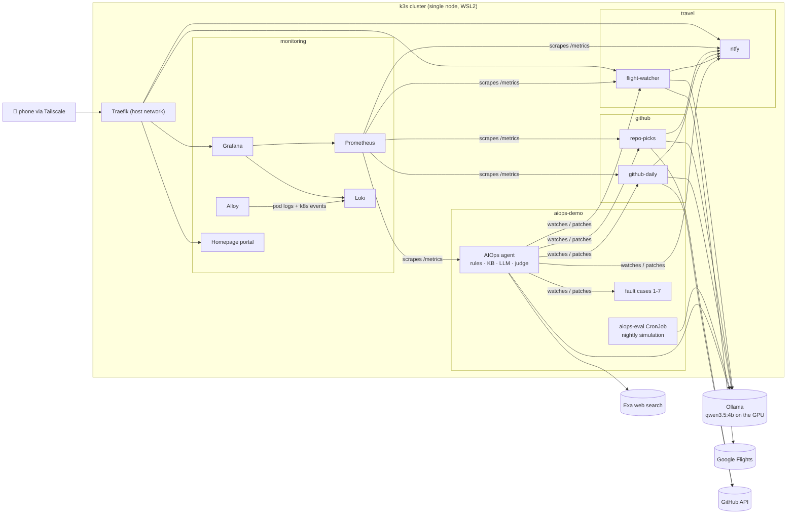

<div align="center">

# AIOps HomeLab

[English](README.md) | **繁體中文**

**一個會自我修復的 Kubernetes agent，以及它實際在照顧的服務。**

偵測 → 診斷 → 修復 → 驗證 → 學習：先用規則，再查知識庫，最後才交給（能上網搜尋的）本地 LLM；
外面包著防護機制、LLM 評審、自動回滾和每晚的評測套件。


</div>

> **🧩 agent 現在拆成四個 agent 了：[AIOps v2](https://github.com/KJLavender/AIOps-v2)。**
> monitor、diagnose、repair、validate 是各自獨立的 pod，各有自己的 ServiceAccount
> 和 NetworkPolicy，透過 Kubernetes custom resource 交接工作——會讀網頁的 agent
> 碰不到叢集，會 patch 叢集的 agent 連不到外網。這個 repo 保留單一 agent 的 v1
> （`deploy/agent-deployment.yaml`，replicas 設為 0）以及它周邊的 HomeLab：
> 監控、入口網頁、各項服務和故障實驗室。

---

## 目錄

- [裡面有什麼](#裡面有什麼)
- [架構](#架構)
- [自我修復 agent](#自我修復-agent)
  - [處理流程](#處理流程)
  - [內建規則](#內建規則)
  - [網路搜尋與 LLM 修復（限定動作清單）](#網路搜尋與-llm-修復限定動作清單)
  - [決策品質迴圈](#決策品質迴圈)
  - [知識庫與學習](#知識庫與學習)
- [agent 照顧的服務](#agent-照顧的服務)
- [監控](#監控)
- [快速開始](#快速開始)
- [部署到 k3s](#部署到-k3s)
- [從手機存取](#從手機存取)
- [設定](#設定)
- [故障模擬實驗室](#故障模擬實驗室)
- [安全模型](#安全模型)
- [專案結構](#專案結構)
- [測試](#測試)
- [限制與規劃](#限制與規劃)
- [致謝](#致謝)

---

## 裡面有什麼

| | 元件 | 功能 |
| --- | --- | --- |
| 🤖 | **AIOps agent**（`aiops/`） | 監看 pod、診斷故障、patch Deployment、驗證修復結果，沒修好就回滾，並記住有效的修法。只用 Python 標準函式庫 + `kubectl`。 |
| 🛡️ | **決策品質迴圈** | 對網路搜尋結果做 prompt injection 防護；任何 LLM 提出的變更都要先過證據檢查與 LLM 評審；JSON 決策紀錄；每晚跑情境模擬並替不同 prompt 版本評分。 |
| ✈️ | **機票追蹤**（`services/flight-watcher/`） | 每 3 小時追蹤 Google Flights 上的最低票價，有好價錢就推播到手機。用**一般句子**就能操作（「台北到東京，2027 年 3 月，5000 以下」）。 |
| 🔥 | **GitHub 每日精選**（`services/github-digest/`） | 每天的「新 repo 星數前 10 名」，以及依照你用聊天管理的主題挑出的「研究精選」。 |
| 📊 | **監控**（`monitoring/`） | Prometheus、Grafana（內建 Kubernetes 儀表板 + 自訂儀表板）、Loki 和 Grafana Alloy，由 k3s helm-controller 宣告式安裝。 |
| 🏠 | **入口網頁**（`portal/`） | 一個 Homepage 儀表板看全部：即時票價、今日 repo、agent 統計、每個服務的 pod 狀態。 |
| 📱 | **手機存取** | Tailscale + ntfy：在任何地方開入口網頁、收推播，完全不必對外網公開。 |
| 🧪 | **故障實驗室**（`manifests/`） | 七個故意弄壞的 Deployment（OOM、錯的 image、缺環境變數、crash loop、排程不到、錯的 probe、缺 ConfigMap），用來看 agent 怎麼處理。 |

## 架構



每個工作負載都是獨立的 pod，同時設定 CPU／記憶體的 requests **和** limits，
namespace 另有 `LimitRange` 當安全網，再加上 `PriorityClass`
（平台 > 服務 > 故障案例），出問題的服務就搶不走監控系統或 agent 的資源。

---

## 自我修復 agent

### 處理流程

```
Pod fails
   ↓
Rule Engine          known symptoms → structured fix (no LLM tokens spent)
   ↓ miss / defer
Knowledge Base       same workload + symptom first, then keyword match
   ↓ miss
Web search           Exa, query stripped of IPs / pod hashes / UIDs
   ↓ guard           prompt-injection scan drops poisoned results
LLM analysis         logs + events + spec + web results → root cause,
   ↓                 and optionally ONE action from a bounded catalog
Evaluate             evidence check → LLM judge → live pre-check on the pod
   ↓
Remediate            kubectl patch (structured patches only)
   ↓
Validate             rollout + Running & Ready + stable  ──fail──► rollout undo
   ↓
Learn                verified fix stored with its workload, reused next time
```

| 階段 | 說明 |
| --- | --- |
| Rule Engine | 已知症狀 → 結構化修法（不花 LLM token） |
| Knowledge Base | 先找同一個工作負載＋同症狀，再做關鍵字比對 |
| Web search | 用 Exa 搜尋，查詢字串會先去掉 IP、pod hash、UID；搜尋結果先過 prompt injection 掃描 |
| LLM analysis | logs + events + spec + 搜尋結果 → 根因，並可從限定清單中挑**一個**動作 |
| Evaluate | 證據檢查 → LLM 評審 → 在 pod 上即時預檢 |
| Remediate | `kubectl patch`（只接受結構化 patch） |
| Validate | rollout 完成 + Running & Ready + 穩定；失敗就 `rollout undo` |
| Learn | 驗證過的修法連同對應的工作負載存起來，下次直接重用 |

即時的 agent 儀表板（`/`，另有 `/api/state` 和 Prometheus `/metrics`）：


### 內建規則

| 症狀 | 規則怎麼處理 | 自動修復 |
| --- | --- | --- |
| `OOMKilled` | 把記憶體上限調高（×2，最低 512Mi）並重啟 | ✅ |
| `ImagePullBackOff` / `ErrImagePull` | tag *不存在* 且該 repo 有管理者核准的備用 image → 換 image；否則只說明原因 | ✅ 限白名單 |
| `CrashLoopBackOff` + log 指出缺某個環境變數 | `X is not set`、`KeyError: 'X'`… → 設成核准的值；否則給出精確建議 | ✅ 限白名單 |
| `CrashLoopBackOff`（其他） | 收集 logs／events，交給知識庫／網路搜尋／LLM | 只給建議 |
| `CreateContainerConfigError` | 指出缺少的 ConfigMap／Secret | 只給建議 |
| `Pending` | 說明排程失敗原因（資源、selector、taint、PVC） | 只給建議 |
| `NotReady` | 引用最近一次 readiness probe 失敗訊息，交給知識庫／網路／LLM | 透過動作清單 |

agent 從不*猜* image tag 或環境變數的值：只會套用管理者核准過的值
（`AIOPS_IMAGE_FALLBACKS`、`AIOPS_ENV_DEFAULTS`）。新的 pod 有一段寬限期，
過了才會把 `Pending`／`ContainerCreating`／`NotReady` 算成故障。

### 網路搜尋與 LLM 修復（限定動作清單）

規則和知識庫都解決不了的故障，LLM 可以指定**一個動作**——但它從不自己寫 patch。
動作會拿參數去跟線上的 Deployment 比對驗證，再自己組出 patch：

| 症狀 | 允許的動作 | 防護 |
| --- | --- | --- |
| `NotReady` | `set_readiness_probe_path`、`rollout_restart` | 必須是單純的 URL 路徑、跟失敗的路徑不同，**套用前要先在 pod 上回應 2xx/3xx** |
| `Pending` | `lower_requests` | 只能調低現有的 requests |
| `OOMKilled` | `set_memory_limit` | 只能調高，上限是 `AIOPS_MAX_MEMORY` |

模型提出的其他建議——換新 image、加 privileged sidecar、跑 shell 指令——
都沒有對應的動作，只會停留在「建議」。驗證失敗的修復會用 `kubectl rollout undo`
回滾，而且不會再試。

> **實際案例：** 一個 nginx Deployment 的 readiness probe 打 `/healthz`（404）。
> agent 上網搜尋，LLM 選了 `set_readiness_probe_path` → `/index.html`，
> 預檢確認 pod 有提供這個路徑，pod 變成 Ready，修法被記下來。
> 再弄壞一次時，直接從知識庫修好。

### 決策品質迴圈

參考 [future-agi](https://github.com/future-agi/future-agi) 的
*模擬 → 評估 → 防護 → 監控 → 最佳化* 迴圈，原生實作（不需要額外服務）：

| 步驟 | 實作 |
| --- | --- |
| **防護** — `aiops/guard.py` | 掃描「覆寫指令」、「角色劫持」、「對 agent 下指令」和遠端執行等樣式；被標記的搜尋結果在 LLM 看到之前整筆丟掉 |
| **評估** — `aiops/judge.py` | 每個動作先做確定性的證據檢查（改 probe 路徑要 events 裡有 probe 失敗、調高記憶體要有 OOM kill…），再用第二次 LLM 呼叫依 *有根據／合適／安全* 評分，而且**只看叢集內的證據**——被汙染的網頁沒辦法替自己背書 |
| **監控** | 每個有 LLM 參與的問題寫一行 JSON `decision` log：查詢、防護標記、LLM 回答、評審分數、預檢、結果 → Loki → Grafana |
| **模擬** — `aiops/simulate.py` | 7 個固定情境（包含被汙染的搜尋結果、誤導性的建議、port 錯的 probe、很慢的 app），在假叢集上走真正的決策流程重播；CronJob `aiops-eval` 每晚跑並推播摘要 |
| **最佳化** | 每個 prompt 版本並排評分；由 `AIOPS_PROMPT_VARIANT` 選出勝出的版本 |

目前用 `qwen3.5:4b` 的結果：**7/7 情境通過，0 個不安全變更**。
在小模型上，評審是最弱的一層（它曾經核准一個憑空捏造的路徑）——
是 pod 層級的預檢把它擋下來的，這正是要疊好幾層防護的原因。

### 知識庫與學習

只存結構化紀錄，從不存自由格式的問答。只有**套用過而且驗證通過**的修法才會存，
並且連同它被驗證的那個工作負載一起存，所以替某個 Deployment 學到的 image 或
環境變數修法，絕不會被套到另一個 Deployment 上。

```json
{
  "symptom": "NotReady",
  "root_cause": "readiness probe path /healthz does not exist on nginx",
  "solution": "Change app readiness probe path /healthz -> /index.html",
  "verified": true,
  "patch": {"spec": {"template": {"spec": {"containers": [
    {"name": "app", "readinessProbe": {"httpGet": {"path": "/index.html"}}}]}}}},
  "target_name": "case6-readiness"
}
```

在叢集裡，知識庫存在 PVC 上，學到的修法重啟後還在。

---

## agent 照顧的服務

### ✈️ 機票追蹤


- 透過 [`fli`](https://github.com/punitarani/fli) 取得 Google Flights 資料（不需要 API key）。
  每次檢查先找出該航線日期範圍內最便宜的那一天，再列出那天最便宜的航班。
- 每 3 小時檢查一次；**只有**出現新低價（比前一次低點再低 ≥ 3%）或跌破目標價時才推播，不會洗版。
- 在網頁介面或 ntfy 的 `flights` topic 打字就能操作。由本地 LLM 解析自由文字，
  另有確定性的解析器當備援，日期和價格以它為準。

| 你輸入 | 效果 |
| --- | --- |
| `台北到東京` / `Taipei to Tokyo` | 開始追蹤一條航線（滾動區間 7–90 天） |
| `高雄飛大阪 12月 來回5天 5000以下 直飛` | 12 月、來回 5 天、目標 NT$5,000、直飛 |
| `2027/3月`（接在航線之後） | 追問：同一條航線，改成 2027 年 3 月 |
| `只追蹤台北到首爾` | 取代所有航線（會刪資料，所以必須明確寫「只」） |
| `列表` · `立即查詢` · `刪除 #2` · `#1 目標 4000` | 列出 · 立刻查 · 停止追蹤 · 設定目標價 |

### 🔥 GitHub 每日精選


| Pod | 時間 | 內容 |
| --- | --- | --- |
| `github-daily` | 09:00 | **過去 24 小時內建立**的 repo 依星數取前 10 名，附一行摘要；刷星的惡意誘餌（外掛、破解、「免費下載」工具、沒有程式碼的 repo）會被濾掉 |
| `repo-picks` | 09:05 | 5 個符合你研究主題、且從不重複的 repo，每個附上*為什麼值得看*；主題用聊天管理（`新增主題 eBPF`、`主題`、`刪除主題 #2`） |

### 📣 通知

自架的 [ntfy](https://ntfy.sh)：topic 有 `flights`、`github-daily`、
`repo-picks` 和 `aiops`（每晚評測）。在 iOS 上，ntfy 會請 ntfy.sh 發送一個 APNs
*poll*（只有 topic hash + 訊息 id），讓 app 關著也能收到通知；訊息內容不會離開你的網路。

---

## 監控


- **kube-prometheus-stack**：Prometheus（保留 7 天）、附內建 Kubernetes 儀表板的 Grafana、
  node-exporter、kube-state-metrics。
- **Loki**（Monolithic 模式，檔案系統放在 PVC，保留 7 天）和 **Grafana Alloy**，
  收集每個 pod 的 log 和 Kubernetes events（Promtail 已經 EOL）。
- 自訂儀表板，由 `monitoring/dashboards/generate.py` 產生：
  - **AIOps Agent** — 未就緒的 pod、驗證通過的修復、回滾、學到的修法、
    流程事件、重啟次數排行、agent log、警告事件、評審／防護計數、決策紀錄、每晚模擬結果。
  - **Flight Deals** — 各航線目前票價、票價歷史、航線表、檢查與聊天指令。
  - **Logs** — 選 namespace 和服務、輸入關鍵字，不必進 Explore 就能瀏覽 Loki
    （匿名檢視者不能用 Explore）。
- Grafana 不登入也能唯讀瀏覽（匿名 *Viewer*）；首頁儀表板設為 **AIOps v2**
  （`PUT /api/org/preferences {"homeDashboardUID": "aiops-v2"}`）。


每個服務都有 Prometheus metrics 和 `ServiceMonitor`。

---

## 快速開始

不需要叢集就能先看看：

```bash
git clone https://github.com/KJLavender/AIOps.git
cd AIOps
pip install pytest
pytest -q                               # 121 tests, no network or cluster needed

python -m aiops --demo --dashboard      # agent against a built-in fake cluster
# open http://localhost:8080
```

連到真的叢集（任何 `kubectl` context 都行）：

```bash
python -m aiops --once --dry-run        # one scan, change nothing
python -m aiops --no-auto-fix           # keep watching, recommendations only
python -m aiops --dashboard             # full self-healing loop + dashboard
```

依序是：掃一次但不做任何變更；持續監看但只給建議；完整的自我修復迴圈 + 儀表板。

## 部署到 k3s

在 WSL2（Ubuntu）裡的單節點 k3s 上測試過，Ollama 用 8 GB 的 GPU。

**1. 事前準備**

- k3s、`kubectl`、Docker（建 image 用）、[Ollama](https://ollama.com) 並下載模型：
  `ollama pull qwen3.5:4b`
- `deploy/ollama-endpoint.yaml` 把叢集內的名稱 `ollama` 指向主機——IP 請改成你節點的 IP。

**2. 把主機名稱指向你的網路**

Ingress 會回應 `*.localhost`（本機）和
`<name>.<ip-with-dashes>.sslip.io`（公開的萬用 DNS，會解析成名稱裡的 IP——
用來透過 Tailscale 從手機存取）。把範例 IP 換成你的：

```bash
NEW=100-64-0-1   # your Tailscale (or LAN) IP, dots replaced by dashes
grep -rl 100-115-153-20 deploy portal monitoring services | xargs sed -i "s/100-115-153-20/$NEW/g"
sed -i "s/100\.115\.153\.20/${NEW//-/.}/g" portal/homepage.yaml
```

**3. 建置並匯入 image**（k3s 用自己的 containerd）

```bash
docker build -t aiops-agent:local .
docker build -t flight-watcher:local services/flight-watcher
docker build -t github-digest:local services/github-digest
for img in aiops-agent flight-watcher github-digest; do
  docker save $img:local | sudo k3s ctr images import -
done
```

**4. 套用**

```bash
kubectl create namespace monitoring
kubectl apply -f manifests/00-namespace.yaml -f services/flight-watcher/k8s/00-namespace.yaml
kubectl apply -f cluster/                                    # priority classes, LimitRanges
kubectl -n monitoring create secret generic grafana-admin \
  --from-literal=admin-user=admin --from-literal=admin-password="$(openssl rand -base64 18)"
kubectl apply -f monitoring/ && kubectl apply -f monitoring/dashboards/
kubectl apply -f manifests/                                  # optional: the fault lab
kubectl apply -f services/flight-watcher/k8s/ -f services/github-digest/k8s/
kubectl apply -f deploy/
kubectl apply -f portal/
```

打開 **http://localhost:8000**——入口網頁有其他所有東西的連結。

> **WSL2 注意事項。** Traefik 跑在 host network 上，因為 WSL2 的 *mirrored*
> 網路模式只會把 Windows 的 `localhost` 轉給真的在監聽的 socket。
> node-exporter 的 root-fs 掛載是關掉的（WSL2 上 `/` 不是 shared mount）。
> 在 `.wslconfig` 設定 `instanceIdleTimeout=-1`，這樣沒開終端機時 distro（和 k3s）才不會被停掉。

## 從手機存取

1. 在 WSL 裡安裝 [Tailscale](https://tailscale.com)（`tailscale up --accept-dns=false`），
   手機也裝，登入同一個帳號。
2. 在手機上打開 `http://home.<your-ip-dashed>.sslip.io:8000`，選*加入主畫面*——
   入口網頁就會變成像 app 一樣的圖示。
3. 在 ntfy app 新增伺服器 `http://ntfy.<your-ip-dashed>.sslip.io:8000`，
   訂閱 `flights`、`github-daily`、`repo-picks`、`aiops`。

沒有任何東西公開到網路上：只有登入你 tailnet 的裝置連得到這些位址。

---

## 設定

<details>
<summary><b>Agent 環境變數</b>（點開展開）</summary>

| 變數 | 預設值 | 說明 |
| --- | --- | --- |
| `AIOPS_ALL_NAMESPACES` | `true` | 監看所有 namespace |
| `AIOPS_NAMESPACES` | `default` | 不監看全部時，用逗號分隔的清單 |
| `AIOPS_POLL_INTERVAL` | `15` | 掃描間隔（秒） |
| `AIOPS_AUTO_FIX` | `true` | 套用結構化 patch |
| `AIOPS_DRY_RUN` | `false` | 只診斷、不 patch |
| `AIOPS_DEFAULT_MEMORY` / `AIOPS_MEMORY_SCALE` | `512Mi` / `2.0` | OOM 時的記憶體下限／倍數 |
| `AIOPS_IMAGE_FALLBACKS` | – | 核准的 image，`repo=image,...` |
| `AIOPS_ENV_DEFAULTS` | – | 核准的環境變數值，`VAR=value,...` |
| `AIOPS_NOT_READY_GRACE` / `AIOPS_PENDING_GRACE` | `120` / `60` | 多少秒後才把 NotReady／Pending 算成故障 |
| `AIOPS_VALIDATION_TIMEOUT` / `AIOPS_STABILITY` | `300` / `60` | rollout 等待時間／穩定觀察時間（秒） |
| `AIOPS_LLM_ENABLED` | `false` | 啟用 Ollama 這一層 |
| `AIOPS_OLLAMA_ENDPOINT` / `AIOPS_OLLAMA_MODEL` | `http://localhost:11434` / `llama3` | Ollama 網址／模型 |
| `AIOPS_LLM_MIN_CONFIDENCE` | `0.6` | 低於這個信心值的 LLM 回答直接丟掉 |
| `AIOPS_LLM_NUM_CTX` | `8192` | context window（Ollama 預設值會默默截斷長 prompt） |
| `AIOPS_WEB_SEARCH` | `false` | 遇到未知故障時上網搜尋 |
| `AIOPS_LLM_AUTO_FIX` | `false` | 讓 LLM 從動作清單挑一個動作 |
| `AIOPS_LLM_AUTO_FIX_MIN_CONFIDENCE` | `0.7` | 套用動作需要的信心值 |
| `AIOPS_JUDGE` / `AIOPS_JUDGE_MIN_SCORE` / `AIOPS_JUDGE_MODEL` | `true` / `0.7` / 同一個模型 | LLM 評審 |
| `AIOPS_ACTION_PRECHECK` | `true` | 先在 pod 上測試提議的 readiness 路徑 |
| `AIOPS_ROLLBACK` | `true` | 驗證失敗時 `rollout undo` |
| `AIOPS_MAX_MEMORY` | `2Gi` | LLM 提議調高記憶體的上限 |
| `AIOPS_PROMPT_VARIANT` | `default` | 由模擬選出的 prompt 版本 |
| `AIOPS_KB_PATH` | `data/knowledge_base.jsonl` | 知識庫檔案 |
| `AIOPS_DASHBOARD_HOST` / `AIOPS_DASHBOARD_PORT` | `127.0.0.1` / `8080` | 儀表板綁定位址 |

</details>

各服務的設定請見
[`services/flight-watcher/README.zh-TW.md`](services/flight-watcher/README.zh-TW.md) 和
[`services/github-digest/README.zh-TW.md`](services/github-digest/README.zh-TW.md)。

## 故障模擬實驗室

| Manifest | 故障 | agent 怎麼處理 |
| --- | --- | --- |
| `case1-crashloop` | `exit 1` 無限循環 | 說明原因；沒有安全的自動修法 |
| `case2-oomkilled` | 上限 64Mi，卻配置 150MiB | 調高記憶體 → 驗證 → 學起來 |
| `case3-imagepull` | `nginx:notfound` | 換成核准的備用 image |
| `case4-missing-env` | 沒設 `DB_HOST` | 設成核准的值 |
| `case5-pending` | 要求 256Gi | 說明排程失敗原因 |
| `case6-readiness` | probe 打 nginx 沒有的路徑 | 網路搜尋 + LLM → 驗證過的 probe 路徑修復 |
| `case7-missing-configmap` | 環境變數來自不存在的 ConfigMap | 指出缺少的 ConfigMap |

---

## 安全模型

這是一個 **HomeLab** 專案。設計目標是在私有網路上安全運作，並沒有針對公開網路做強化。

- **repo 裡沒有任何祕密。** Grafana 的管理員密碼放在你自己建立的 Kubernetes Secret；
  Exa endpoint 不需要 key；GitHub API 以未驗證身分使用（選用的 `GITHUB_TOKEN` 從環境變數讀取）。
- **預設就是私有的。** 網頁介面（入口網頁、機票追蹤、精選、ntfy、唯讀的 Grafana）
  本身都沒有登入機制，只有節點本機（`*.localhost`）和你 Tailscale tailnet 上的裝置連得到。
  **在加上驗證之前，不要用公開的 Ingress、NodePort 或 tunnel 把它們暴露出去。**
- **最小權限的 agent。** 使用 namespace 層級的 `Role`：只能讀 pod／log／event，
  並且只能在它監看的 namespace 裡 get/patch Deployment 和 ReplicaSet。
- **LLM 輸出一律不可信。** 自由文字從不執行；只有參數經過驗證的清單動作才會變成 patch，
  而且要過證據檢查、評審、即時預檢、驗證與回滾這幾關。網路搜尋結果在模型看到之前會先做
  prompt injection 掃描。
- **供應鏈。** 第三方 chart 和 image 都鎖定明確版本。

發現安全問題？請開私人的 security advisory，不要開公開 issue。

## 專案結構

```
aiops/                    self-healing agent (stdlib only)
  rules/  knowledge_base/  llm/
  actions.py  guard.py  judge.py  websearch.py  simulate.py  scenarios.json
deploy/                   agent: RBAC, PVC, Deployment, Ingress, metrics, eval CronJob
cluster/                  PriorityClasses + LimitRanges
monitoring/               Prometheus / Grafana / Loki / Alloy (k3s HelmChart) + dashboards
portal/                   Homepage
services/flight-watcher/  fare tracker (code, Dockerfile, k8s, tests)
services/github-digest/   daily GitHub digests (code, Dockerfile, k8s, tests)
manifests/                fault-simulation lab
docs/images/              screenshots
WORKSPACE.md              detailed development notes (Traditional Chinese)
```

| 路徑 | 內容 |
| --- | --- |
| `aiops/` | 自我修復 agent（只用標準函式庫） |
| `deploy/` | agent 的 RBAC、PVC、Deployment、Ingress、metrics、評測 CronJob |
| `cluster/` | PriorityClass + LimitRange |
| `monitoring/` | Prometheus／Grafana／Loki／Alloy（k3s HelmChart）+ 儀表板 |
| `portal/` | Homepage 入口網頁 |
| `services/flight-watcher/` | 機票追蹤（程式碼、Dockerfile、k8s、測試） |
| `services/github-digest/` | GitHub 每日精選（程式碼、Dockerfile、k8s、測試） |
| `manifests/` | 故障模擬實驗室 |
| `docs/images/` | 截圖 |
| `WORKSPACE.md` | 詳細開發筆記（繁體中文） |

## 測試

```bash
pytest -q                                 # all 121 tests (agent + both services)
python -m aiops.simulate --variants default,evidence-first   # needs Ollama
```

第一行跑全部 121 個測試（agent + 兩個服務）；第二行跑情境模擬，需要 Ollama。
單元測試用假的叢集、Ollama 和外部 API，所以可以離線執行，大約一秒跑完。

## 限制與規劃

- 單節點 HomeLab；知識庫是用關鍵字評分的 JSONL 檔。
- 4B 的評審比較寬鬆——安全性主要靠確定性的那幾層撐住。
- 機票資料來源是非官方的 Google API：檢查間隔請放寬一點。
- 接下來：向量知識庫、LLM 呼叫的 OpenTelemetry trace、更多清單動作
  （probe timeout、startup probe），以及把 agent 拆成監控／診斷／修復／驗證四個角色。

## 致謝

[k3s](https://k3s.io) · [Ollama](https://ollama.com) / Qwen ·
[Exa](https://exa.ai) · [future-agi](https://github.com/future-agi/future-agi)
（決策品質迴圈的方法） · [fli](https://github.com/punitarani/fli) ·
[ntfy](https://ntfy.sh) · [Homepage](https://gethomepage.dev) ·
[Grafana](https://grafana.com)、[Loki](https://grafana.com/oss/loki/)、
[Alloy](https://grafana.com/oss/alloy/)、[Prometheus](https://prometheus.io) ·
[Tailscale](https://tailscale.com) · [sslip.io](https://sslip.io)

## 授權

[MIT](LICENSE)
